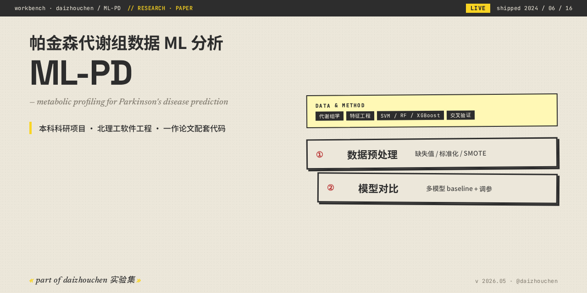

<!-- daizhouchen-banner-begin -->
<p align="center">
  
</p>

> **帕金森代谢组数据机器学习分析 — 本科科研项目，北理工软件工程。**
>
> *metabolic profiling machine learning for Parkinson's disease prediction.*
<!-- daizhouchen-banner-end -->

# ML-PD

## 关于

本仓为本科期间科研项目「**基于 AI 的帕金森代谢组数据分析与疾病发展预测**」的代码档案。

研究使用代谢组学数据 + 机器学习方法对帕金森病（Parkinson's Disease）进行特征提取、模型对比与预测分析。

## 数据与方法

- **数据**: 帕金森患者代谢组学公开数据集
- **预处理**: 缺失值处理、标准化、SMOTE 处理类不平衡
- **特征工程**: 代谢物表达量特征 + 临床特征
- **模型对比**: SVM / Random Forest / XGBoost / 多模型 baseline
- **评估**: 交叉验证 + ROC-AUC + 特征重要性分析

## 结构

```
ML-PD/
├── data/              # 数据预处理脚本与中间产物（部分原始数据未公开）
├── notebooks/         # Jupyter 实验记录
├── models/            # 模型训练与预测代码
└── results/           # 输出图表与分析报告
```

## Reproduce Setup

```bash
git clone https://github.com/daizhouchen/ML-PD.git
cd ML-PD
pip install -r requirements.txt   # 如有
jupyter notebook                  # 直接看 notebooks
```

## 背景

- 北京理工大学 · 软件工程本科 · 科研方向探索
- 配套论文以一作身份成稿（详细信息见联系作者）

## License

MIT


---
<!-- daizhouchen-footer-begin -->

Part of [**daizhouchen 实验集**](https://github.com/daizhouchen) → 一个 AI 应用创造者的实验现场。
<!-- daizhouchen-footer-end -->

