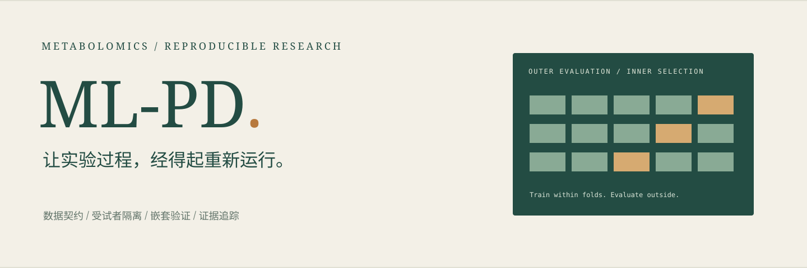

<p></p>

# ML-PD · 代谢组学分类研究工作流

[](https://github.com/daizhouchen/ML-PD/actions/workflows/ci.yml)

[](LICENSE)

研究健康对照、前驱期与帕金森病三组代谢组学数据的分类问题。保留早期探索性 Notebook，同时提供**受试者隔离、嵌套交叉验证、可追踪结果的命令行实验流程**。

**[打开交互研究展示 →](https://daizhouchen.github.io/ML-PD/)** · [实验方法](docs/methodology.md) · [数据契约](docs/data-contract.md) · [历史实验审查](docs/legacy-audit.md)

> **项目边界**：原始合作数据未公开，本次工程改进尚未在该数据上重新验证。公开图表来自固定种子的**合成数值数据**，用于验证代码与展示流程，不代表真实代谢物、患者或临床效果。横断面分类不等于疾病进展预测。

## 现在可以完成什么

| 环节 | 已实现 |
|---|---|
| 数据接入 | 显式指定标签、样本、受试者与特征列；校验标识符泄漏、未知标签、重复记录、无穷值和冲突标签 |
| 实验任务 | 三分类，以及 PD–Control、Prodromal–Control、PD–Prodromal 三组两两分类 |
| 模型对照 | 类别先验基线、逻辑回归、线性 SVM、随机森林、决策树、GBM、XGBoost |
| 特征处理 | 每个训练折独立学习缺失率过滤、常量过滤、中位数填补、标准化与 RFE |
| 评估设计 | 外层评估、内层调参；重复样本按受试者分组，两个层级都禁止同一受试者跨训练与验证 |
| 研究产物 | 各折指标、折间标准差、逐类 ROC、OOF 混淆矩阵、特征入选频率、划分记录与版本指纹 |
| 展示与验证 | 可切换任务/模型的静态报告、可下载结果 JSON、独立 SVG 图、测试与 GitHub Actions |

## 五分钟开始

推荐 Python 3.12，在隔离环境安装锁定依赖：

```bash
git clone https://github.com/daizhouchen/ML-PD.git
cd ML-PD
python -m venv .venv
# macOS / Linux: source .venv/bin/activate
# Windows PowerShell: .venv\Scripts\Activate.ps1
python -m pip install -r requirements-lock.txt
python -m pip install --no-deps -e .

mlpd demo --output data/demo --samples 180 --seed 2026
mlpd validate --data data/demo/synthetic.csv --schema data/demo/schema.json
mlpd run --data data/demo/synthetic.csv --schema data/demo/schema.json --output runs/quick --models dummy logistic --outer-folds 3 --inner-folds 2
```

最后一条实际运行四个任务，生成 `runs/quick/report.json` 和 `figures/`。输入与结果目录默认被 Git 忽略，命令不会覆盖已有数据或非空实验目录。

运行全部七个模型（运行时间取决于机器）：

```bash
mlpd run --data data/demo/synthetic.csv --schema data/demo/schema.json --output runs/full --outer-folds 3 --inner-folds 3
mlpd publish-demo --report runs/full/report.json --output docs/results
python -m http.server 8000 --directory docs
```

访问 `http://localhost:8000` 浏览报告。正式研究默认 5 外折、3 内折；应在看结果前按独立受试者数确定方案，不能为更好看的分数反复换种子或折数。

## 方法为什么这样改


```mermaid
flowchart LR
    A[显式数据契约] --> B[按受试者划分外层训练 / 测试]
    B --> C[仅外层训练数据进入内层 CV]
    C --> D[每折重学过滤 / 填补 / 标准化 / RFE]
    D --> E[搜索特征数量与模型参数]
    E --> F[最佳流程重拟合外层训练集]
    F --> G[对未见外层测试折预测一次]
    G --> H[汇总指标与运行指纹]
```

早期 RFE Notebook 在全量数据上筛选后再划分测试集，会使测试信息参与筛选。新流程将 RFE 与全部预处理一起放进内层搜索的 Pipeline。内层用 **balanced accuracy** 选参数，外层只评估。

RFE 使用逻辑回归作为共同排序器，搜索保留 50% 或全部可用特征；它与历史模型专属 RFECV 不是同一实验。详见[方法与限制](docs/methodology.md)。

## 一次运行留下什么

```text
runs/<run-name>/
├── report.json             # 配置、环境、数据指纹、全部任务与模型结果
├── fold_metrics.csv        # 每个外层测试折的指标
├── feature_stability.csv   # 跨外折入选频率，不是生物标志物结论
├── split_assignments.csv   # 本地样本/受试者与外折归属，不应公开
└── figures/                # 带数据类型标注的独立 SVG 图
```

展示默认以逻辑回归为参考，提供全部模型切换，不按演示分数挑冠军。折间 SD **不是置信区间**；ROC 是各外折曲线的平均，SVM 分数不解释为概率。

## 接入真实数据

阅读[数据契约](docs/data-contract.md)，复制 `configs/schema.example.json`，显式列出允许使用的特征。输入应保留缺失值；若已在全量样本上做过填补、标准化或筛选，新 Pipeline 无法撤销既有泄漏。

```bash
mlpd validate --data data/private/cohort.csv --schema configs/my-schema.json
mlpd run --data data/private/cohort.csv --schema configs/my-schema.json --output runs/private-study
```

`data_kind` 设为 `private`。自动公开导出仅接受合成演示结果，不会复制样本级划分文件。真实结果需单独完成来源授权与披露审阅。

## 代码地图

```text
src/mlpd/           数据校验、模型、嵌套评估、图表和 CLI
tests/              数据边界、受试者隔离、训练范围与完整运行测试
configs/            私有数据 schema 示例
docs/               交互展示、方法、数据契约、历史审查、合成结果
notebooks/          新流程最小复现入口
ML.ipynb            历史三分类实验，保留供溯源
RFE.ipynb           历史特征筛选实验，存在方法局限
ML - 二分类/         历史两两分类实验
RFE - 二分类/        历史两两 RFE 实验
```

需要交互 Notebook 时，另装 `python -m pip install -e ".[notebook]"`，再用该环境打开 `notebooks/01_reproduce.ipynb`。

## 验证与后续研究

```bash
python -m pytest -q
python -m build
```

尚需真实数据支持：原始未泄漏数据重跑；采集批次、站点和混杂因素敏感性分析；候选特征稳定性验证；独立外部队列评估。进展预测需要随访时间与结局的纵向方案，不在现有横断面流程中推断。

方法依据：[数据泄漏与 Pipeline](https://scikit-learn.org/stable/common_pitfalls.html)、[嵌套交叉验证](https://scikit-learn.org/stable/auto_examples/model_selection/plot_nested_cross_validation_iris.html)、[分层分组划分](https://scikit-learn.org/stable/modules/generated/sklearn.model_selection.StratifiedGroupKFold.html)。

MIT · [戴宙辰的实验集](https://github.com/daizhouchen)
