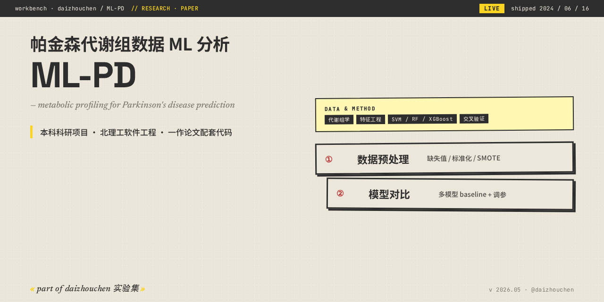

<!-- daizhouchen-banner-begin -->
<p align="center">
  
</p>

> **帕金森病代谢组学 × 机器学习：三分类诊断与病程预测的完整实验记录。**
>
> *Metabolic profiling machine learning for Parkinson's disease prediction.*
<!-- daizhouchen-banner-end -->

# ML-PD

## 简介

本仓库是**基于代谢组学数据的帕金森病（Parkinson's Disease）机器学习诊断**实验代码档：用代谢物谱特征区分 **健康对照（Control）/ 前驱期（Prodromal）/ 帕金森病（PD）** 三组人群，包含多模型对比与递归特征消除（RFE）的完整 Notebook 流程。

## 实验内容

- **任务**：三分类（Control / Prodromal / PD）+ 三组两两三分类
- **预处理**：缺失值处理、标准化
- **模型对比**：XGBoost / Random Forest / SVM / CART / GBM / 逻辑回归
- **特征选择**：RFE 递归特征消除，定位关键代谢物特征
- **评估**：交叉验证 + 多类 ROC-AUC + 混淆矩阵 + 特征重要性分析

## 仓库结构

```
ML-PD/
├── ML.ipynb                # 主实验：三分类全流程（预处理 → 6 模型对比 → ROC）
├── RFE.ipynb               # 递归特征消除：筛选关键代谢物特征
├── ML - 二分类/             # 两两三分类模型实验
│   ├── model-pd-control.ipynb
│   ├── model-prodromal-control.ipynb
│   └── model-prodromal-pd.ipynb
├── RFE - 二分类/            # 对应的 RFE 特征选择实验
│   ├── RFE-control-prodromal.ipynb
│   ├── RFE-pd-control.ipynb
│   └── RFE-pd-prodromal.ipynb
└── assets/                 # 展示资源
```

## 环境准备

```bash
git clone https://github.com/daizhouchen/ML-PD.git
cd ML-PD
pip install -r requirements.txt
jupyter notebook        # 直接打开 ML.ipynb / RFE.ipynb
```

> **数据说明**：Notebook 中引用的代谢组学 CSV 数据文件（`代谢组学数据*.csv`）因涉及合作数据来源，未随仓库公开。结构为：前 5 列为样本/分组标识，其余列为代谢物特征；按相同 schema 准备数据即可复现全部流程。

## 定位

- 本科期间科研项目「基于 AI 的帕金森代谢组数据分析与疾病发展预测」的代码档案（北理工软件工程）
- 配套论文以一作身份成稿（详细信息见联系作者）
- 展示：特征工程、多模型对比、RFE 特征选择的完整分析能力

## License

MIT

---
<!-- daizhouchen-footer-begin -->

Part of [**daizhouchen 实验集**](https://github.com/daizhouchen) → 一个 AI 应用创造者的实验现场。
<!-- daizhouchen-footer-end -->
