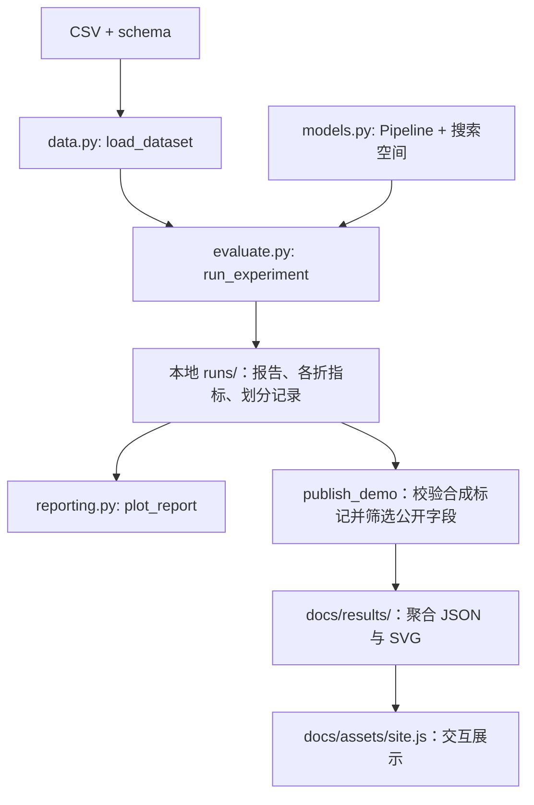

# 模块地图

[文档目录](README.md) · [贡献指南](../CONTRIBUTING.md)

当前可执行逻辑只有一份，位于 `src/mlpd/`。CLI 与 Notebook 共用它；静态网页只读取聚合结果，不负责训练。`archive/` 不参与包构建或持续集成实验。

## 建议阅读顺序

| 顺序 | 文件 | 主要职责 |
|---|---|---|
| 1 | [`cli.py`](../src/mlpd/cli.py) | 解析 `demo`、`validate`、`run`、`publish-demo`，调用对应模块 |
| 2 | [`data.py`](../src/mlpd/data.py) | `Dataset`、四个任务定义、schema 校验、训练折特征过滤与合成输入 |
| 3 | [`models.py`](../src/mlpd/models.py) | 七个模型、完整 sklearn Pipeline 与参数搜索空间 |
| 4 | [`evaluate.py`](../src/mlpd/evaluate.py) | 内外层划分、受试者隔离检查、训练评估、指标与运行记录 |
| 5 | [`reporting.py`](../src/mlpd/reporting.py) | SVG 图表、仅合成结果的聚合公开导出 |

[`__main__.py`](../src/mlpd/__main__.py) 提供 `python -m mlpd`；版本号在 [`__init__.py`](../src/mlpd/__init__.py)。包信息、依赖和 `mlpd` 命令入口由 [`pyproject.toml`](../pyproject.toml) 声明。

## 数据如何流动

特征过滤、填补、标准化和 RFE 都在内层训练 Pipeline 内拟合。新增数据处理步骤时沿用这个边界，不在进入交叉验证前对全队列拟合。具体算法与指标口径见[方法说明](methodology.md)。

## 修改需求对应哪里

| 修改内容 | 实现与同步检查 |
|---|---|
| 输入字段、标签或校验规则 | `data.py`、`configs/schema.example.json`、[数据契约](data-contract.md)、`tests/test_data.py` |
| 模型或超参数 | `models.py`、[方法说明](methodology.md)、`tests/test_evaluation.py`；检查网页是否需要新模型标签 |
| 划分、指标或结果格式 | `evaluate.py`、`tests/test_evaluation.py`、[方法说明](methodology.md)；同步 `reporting.py` 与网页读取逻辑 |
| 命令行选项 | `cli.py`、[运行指南](quickstart.md)，必要时更新 Notebook 示例 |
| 展示内容、视觉或交互 | `docs/index.html`、`docs/assets/`，按[网页维护说明](../docs/README.md)验证 |
| 历史实验的说明 | [archive 索引](../archive/README.md)与[历史审查](legacy-audit.md)，保留原实验内容 |

## 验证入口

[`tests/test_data.py`](../tests/test_data.py) 检查数据契约、输入失败、训练折过滤、合成数据确定性；[`tests/test_evaluation.py`](../tests/test_evaluation.py) 检查受试者隔离、真实拟合范围、完整嵌套运行、公开导出限制与目录覆盖保护。

[`ci.yml`](../.github/workflows/ci.yml) 安装锁定依赖后运行测试、合成数据 CLI 实验和包构建。开发命令与提交约定见[贡献指南](../CONTRIBUTING.md)。
